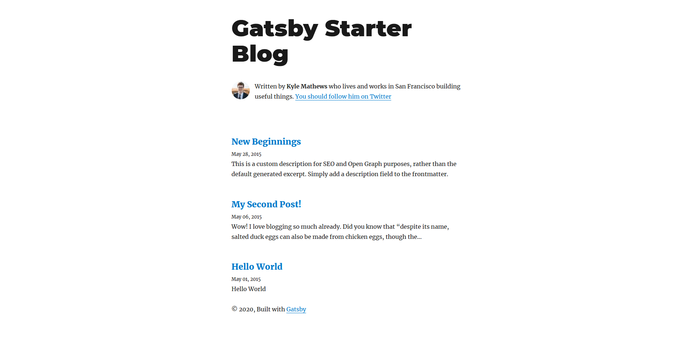
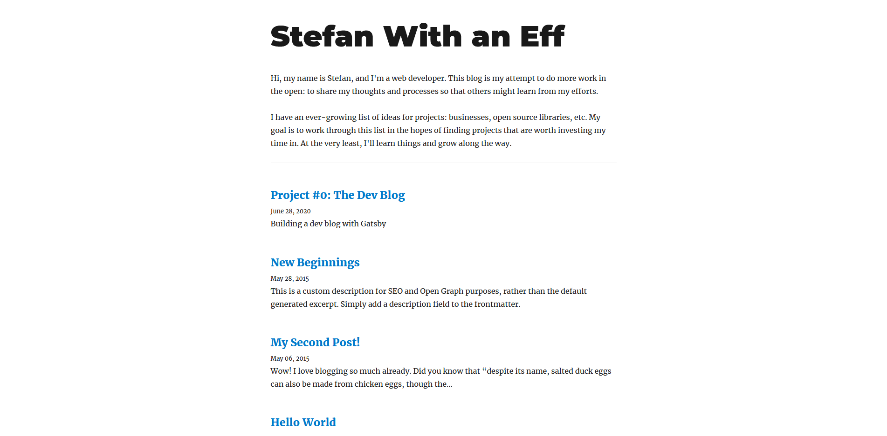

I recently left my job as a senior backend engineer at a large tech company because I started to feel bored and dejected with the work I was doing there. In that corporate setting, I lost my passion for web development. At the same time, I really want to try doing my own thing.

Now that I have some freedom, my aim is to work through a pile of ideas that I've had building up over the course of my time as a developer. Part of this journey is documenting the experience because everyone seems to agree that "building an audience" is an important part of succeeding as an independent developer 🤷

## The Pitch

**A developer blog where I document my efforts as an independent developer, focused on the projects that I complete**

Not the most original idea, I know. It took a while for me to figure out the best way to frame this documenting process. I don't enjoy promoting myself, so focusing on the projects seems like the best way to ease myself in to this.

I was inspired by two people maintaining similar blogs: [Alex West](https://www.alexwest.co/) and [Ben Stokes](https://tinyprojects.dev/). Both blogs are informative and entertaining, and I highly recommend following both of them.

## The Making Of

My first thought in this whole process is "Where are the solutions for hosting a dev blog?" I know what off-the-shelf solutions to reach for in order to build this thing for free, but I would have easily paid \$5/mo to not have to actually learn my way through one of these solutions. Add that to the project pile, I guess.

For creating a blog, there are all sorts of tools that you can use. Plain HTML & CSS is a solid choice. Easy to start with, but gets more complex as you try to do more complex things. Traditional Content Mangement Systems (CMS) like Wordpress were built for this kind of thing, but I don't really need all of the CMS features of Wordpress for a simple public blog. Instead, I have chosen a Static Site Generator (SSG) called [Gatsby](https://www.gatsbyjs.org/).

SSGs take sources of data and programmatically convert them into plain HTML, CSS, and Javascript so that you can easily host the resulting pages on any ol' server. Pretty nifty. Gatsby uses two technologies to convert data to pages: React.js and GraphQL. If you are not familiar with these technologies, it can make working with Gatsby inhibitively difficult/slow, but I have a lot of professional experience working with both, so it seems like the perfect tool.

Two CLI commands from the tutorial later: voila!

Gatsby can generate a blog from a starter template for you. What's great about this setup is that I can now write my blog posts in a more author-friendly format like Markdown. Gatsby will then transform my Markdown files into static HTML. Magic ✨

I'm refraining from adjusting the blog from its initial template too much to avoid slowing me down on things that don't really matter right now. A few tweaks to style and layout and I have something a little more my own.

All that's left is to clean up the posts and deploy. Deployment is pretty easy, just push the codebase up to Github and set up Github Pages. Put a free CDN like Cloudflare in front of it in case of sudden traffic surges, and I'm done!

## Takeaways

Writing is hard, and I'm a perfectionist. It's a bad combo. One of my focuses as I work independently is to really emphasize the 'M' in MVP. So, I'm shipping this blog without any real enhancements or personal stylistic touches. I do have some ideas for enhancing it in the future, though:

- Make the blog look a little more "my own"
- Update the styles to respect dark mode
- Create a tag system for posts and make a "Projects" page for all posts with the projects tag
- Improve the styles specifically for list items because the lack of indentation here is bothering me

For now, it's good enough™️
